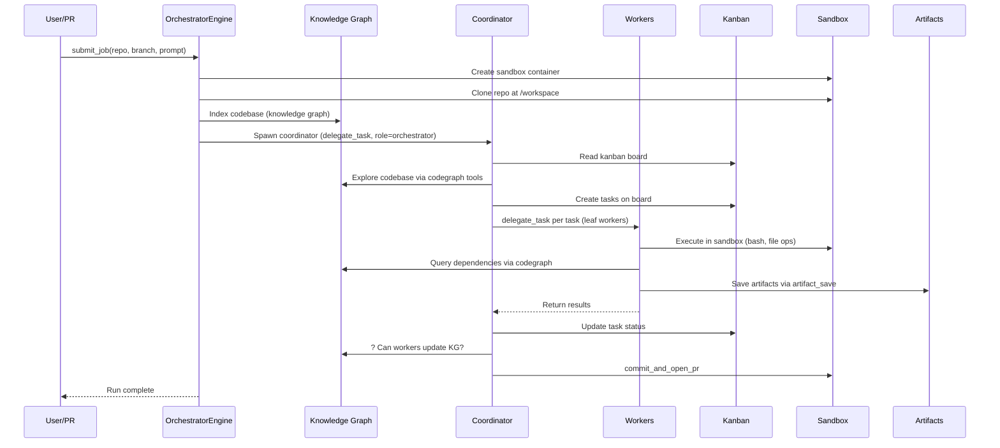

# E2E Agentic Testing Architecture — Research & Gap Analysis

**Date:** 2026-06-17  
**Goal:** Verify all components work end-to-end, identify gaps against production-grade agentic testing platforms, and produce actionable subtasks.

---

## 1. Reference Architecture: How Production Systems Do It

### 1.1 Greptile TREX

**Architecture:** Orchestrator + parallel subagents per issue, sharing review context.

- **Orchestrator Agent** reads the diff, identifies issues worth investigating, spins up one **TREX agent per issue** — all running in **parallel**.
- Subagents inherit the orchestrator's codebase index (KG) — no duplicated exploration.
- Each subagent has its own context window, scoped to a specific issue.
- **Sandbox:** Disposable per-review. Fresh container spun up in milliseconds, thrown away when done. Uses **reusable base images + per-repository snapshots** (clone once, cache, resume). Each review fetches exact PR commits + rotates credentials.
- **Artifacts:** Multi-modal evidence: screenshot, logs, API traces, execution scripts, video. Badged as "trustworthy" — reviewer can verify the run themselves.
- **Evaluation:** Model-agnostic harness. Orchestrator and subagents can use different providers. Evaluation focuses on recall (bug catch rate) and precision (consistency).

```
Greptile Reviewer (orchestrator)
  ├── reads diff, identifies issues
  ├── spins up TREX agent per issue (parallel)
  │     ├── inherits codebase index
  │     ├── sandbox: disposable per-review
  │     └── artifacts: screenshot, logs, traces, video
  └── synthesizes findings + evidence into PR comment
```

### 1.2 Tricentis (Testim + Tosca)

**Architecture:** Specialized agents + MCP server for tool access.

- Team of specialized task-oriented agents: test execution, scheduling, data integrity, quality metrics.
- **MCP Server** gives agents access to all testing tools (Tosca engine, sandbox, data analysis).
- Human-in-the-loop for business requirement context.
- **Vision AI** recognizes web apps from screenshots — reconstructs exercisable tests from visual input.

### 1.3 Mabl

**Architecture:** Agentic platform with 5 Core Skills.

- **Acting** — interact like a real user (click, navigate, scroll, API calls)
- **Observing** — screenshot, DOM snapshot, API results
- **Deciding & Reasoning** — Auto-Healing, Visual Assist, Auto TFA (failure analysis), Intelligent Waits
- **Learning & Remembering** — AI Vectorization + Test Semantic Search. Tests indexed by purpose, not keywords
- **Integrating & Collaborating** — MCP Server for IDE integration ("which tests affected by my change?")

### 1.4 Common Production Patterns

| Pattern | Greptile | Tricentis | Mabl | TestAI |
|---------|----------|-----------|------|--------|
| Orchestrator + subagents | ✅ Subagent per issue | ✅ Specialized agents | ✅ Coordinator + workers | ✅ Coordinator + delegate_task |
| Shared codebase index | ✅ Subagents inherit KG | � N/A | � N/A | ⚠� KG exists, subagent inheritance? |
| Parallel execution | ✅ Per-issue parallelism | ✅ Specialized agents run parallel | ⚠� Limited | ✅ Fan-Out mode |
| Disposable sandbox | ✅ Per-review, ms startup | ✅ In Tosca engine | ✅ Cloud execution | ⚠� Per-run Docker, lifecycle? |
| Multi-modal evidence | ✅ Screenshot, logs, traces, video | ⚠� Screenshots | ✅ Screenshots + DOM | ⚠� Basic evidence capture |
| Model-agnostic | ✅ Different models per agent | � Proprietary | ✅ AI-native | ✅ LLMRouter with fallbacks |
| Failure classification | ✅ Self-healing | ✅ Auto-healing | ✅ Auto TFA | ✅ Reflexion + Recovery |
| MCP integration | � N/A | ✅ MCP server for tools | ✅ MCP for IDE TIA | ✅ MCP client exists |
| KG update after fix | ⚠� Index rebuilt per review | � N/A | ✅ Continuous learning | ⚠� KG exists, update? |

---

## 2. Current TestAI State — Component-by-Component

### 2.1 Orchestrator → Subagent Flow

**Works:** `OrchestratorEngine` → bootstrap → spawn coordinator via `delegate_task` → coordinator spawns workers via `delegate_task` → workers execute tasks.

**Gaps:**
- Coordinator doesn't spawn per-issue subagents in parallel like Greptile does. It uses kanban (sequential task processing).
- No `stream.subagents` pattern (Deep Agents style) — parent can't monitor child progress independently.

### 2.2 Knowledge Graph — Subagent Inheritance

**Works:** `OrchestratorEngine` builds KG at `_index_knowledge_graph()` before spawning coordinator.

**Gaps:**
- Does the coordinator's subagent inherit the KG index? Trace needed: `OrchestratorEngine.run_single()` → `_index_knowledge_graph()` → is the KG path passed to coordinator via system prompt or tool context?
- Can subagents spawned by the coordinator READ the KG? They have `codegraph_explore`, `codegraph_search` tools — these access the KG.
- Can subagents UPDATE the KG after fixing issues? No — KG is write-once at bootstrap.

### 2.3 Sandbox Lifecycle & Isolation

**Works:** Docker container per run (Workspace Container). Single image: `nikolaik/python-nodejs`. Repo cloned at `/workspace`.

**Gaps:**
- **Per-repo isolation:** Two repos in parallel = two sandbox containers. Works for separate runs. What about the same repo with different branches?
- **Sandbox reuse:** Can a subagent reuse the parent's sandbox? `SandboxManager` needs to be passed through delegation chain.
- **Cache vs freshness:** Greptile uses reusable base images + per-repo snapshots. TestAI clones fresh every time.
- **Sandbox lifecycle:** Who tears down sandboxes? What happens to artifacts when sandbox dies?

### 2.4 Evidence & Artifact Pipeline

**Works:** `evidence.py` captures bash commands + screenshots. `artifacts` table stores them. `ToolExecutionCompleted` events reference artifact IDs.

**Gaps:**
- No video capture (Greptile TREX has this).
- No automatic evidence bundling into PR comments.
- No "trustworthiness" badge on evidence — reviewer can't verify independently.
- Evidence is per-tool-execution, not per-finding. Greptile groups evidence by finding (one subagent = one issue = one evidence bundle).

### 2.5 Metrics Collection

**Works:** `token_usage` table, `pipeline_metrics` table, `quality_metrics` table. Cost tracking via `cost_tracker.py`.

**Gaps:**
- No recall/precision metrics (Greptile: bug catch rate, consistency).
- No flaky test tracking across runs (table exists, but is it populated?).
- No coverage trend over time (table exists, `coverage_intelligence_tool` does basic query).
- LLM evaluation (Langfuse LLM-as-judge) is configured but not wired into pipeline completion.

### 2.6 Configuration & Customization

**Works:** Role YAML, `.testai/quality.yaml`, agent prompt files, permissions system.

**Gaps:**
- No per-repo configuration (different repos need different test frameworks, env vars).
- No per-branch policies (PR branch gets tier-2 supervised, main branch gets tier-1 autonomous).
- No webhook-based pipeline triggers (exists for GitHub PRs, but not for issue comments, labels).

---

## 3. E2E Flow: Current Walkthrough



**Key observation:** The flow mostly works. The gaps are in:
1. KG updates after workers finish
2. Sandbox reuse across delegation chain
3. Evidence bundling per finding
4. Metrics-driven evaluation at pipeline end

---

## 4. Gap Analysis & Subtasks

### Subtask A — Knowledge Graph: Read OR Write?

**Problem:** Workers can READ the KG via `codegraph_explore`/`codegraph_search`, but cannot UPDATE it. After a fix, the KG is stale.

**Options:**
1. Workers write L0 artifacts → L1 indexer updates KG asynchronously
2. Coordinator updates KG after workers complete
3. KG is rebuilt per-run (current behavior — but only at bootstrap)

**Recommended:** Option 1 — L0 artifacts already exist (`agent_artifacts` table). The L1 indexer runs as a follow-up. Wire it into pipeline completion.

### Subtask B — Sandbox Lifecycle & Isolation

**Problem:** Sandbox lifecycle is unclear. Who creates, reuses, tears down?

**Current:**
- `OrchestratorEngine` creates sandbox at `_init_sandbox()`
- Workers spawned via `delegate_task` get `sandbox_manager` from parent
- No explicit teardown — relies on Docker cleanup

**Gaps:**
- No per-repo sandbox naming for parallel runs
- No credential rotation per review (Greptile pattern)
- No snapshotted caches (clone once, resume)

### Subtask C — Evidence Pipeline

**Problem:** Evidence captured but not grouped by finding or attached to PR comments.

**Current:**
- `evidence.py` captures bash scripts + screenshots
- Artifacts stored in `artifacts` table
- No automatic PR comment generation with evidence

**Greptile pattern:** One subagent = one evidence bundle = one PR comment section.

### Subtask D — Metrics-Driven Evaluation

**Problem:** No automated evaluation at pipeline end.

**Current:**
- Langfuse sink configured but evaluation not wired
- No recall/precision tracking
- No coverage regression detection

### Subtask E — Configuration

**Problem:** No per-repo, per-branch configuration.

**Current:**
- Global settings only
- No pipeline-level customization

---

## 5. Research Log (appended after each session)

### 2026-06-17 — Initial Research

**Sources:**
- Greptile TREX blog posts (trex-code-execution, trex announcement)
- Tricentis agentic testing (Intellyx analysis)
- Mabl architecture (sii.pl blog, mabl.com)
- Hermes agent (reference source code)

**Key Findings:**
- All production systems converge on orchestrator + subagent pattern
- Greptile's parallel-per-issue subagent model is the most advanced
- Evidence bundling and trustworthiness verification is critical
- Sandbox caching (snapshots) is a major differentiator
- Model-agnostic evaluation harness is table stakes

### Next Session:

- Verify current TestAI sandbox lifecycle in Docker
- Test end-to-end with a real repo
- Map specific integration points for each gap

## 6. File Verification Session — 2026-06-17

### 6.1 ArtifactStore & L1 Indexer

**Verified:** backend/harness/services/artifact_store.py

- ArtifactStore.write_batch() writes to agent_artifacts table — working ?
- derive_l0_items_from_messages() extracts tool_call/tool_result/reflection rows — working ?
- Called from Agent._save_reflections() at run end — working ?
- **Gap:** L1 indexer is 'v0 stub' — hook exists, no actual promotion logic runs

### 6.2 Sandbox Lifecycle

**Verified:** Agent.sandbox_manager in agent.py
- sandbox_manager property backed by self._deps.sandbox_manager ?
- create_subagent() copies sandbox_manager from parent ?
- Subagents via delegate_task get sandbox_manager through agent_factory ?
- **Gap:** No explicit lifecycle (create/teardown). No per-repo naming. No snapshot caching.

### 6.3 Orchestrator ? KG ? Subagent

**Verified:** OrchestratorEngine in orchestrator.py
- _index_knowledge_graph() runs at bootstrap ?
- Coordinator gets codegraph_explore/search/node/callers tools ?
- **Gap:** Subagents can READ KG but cannot UPDATE. After fixes, KG is stale. L0?L1?KG not wired.

### 6.4 Evidence Pipeline

**Verified:** evidence.py + artifact_store.py
- evidence.py captures bash + screenshots at tool execution ?
- artifact_store.py stores L0 artifacts at session end ?
- **Gap:** No grouping by finding. No PR comment generation. No trustworthiness badge.


## 7. CodeGraph Deep Dive — 2026-06-17

### Key Architecture Findings

- **Auto-sync** requires the MCP server daemon running (\codegraph serve --mcp\). Watches OS file events (inotify/FSEvents/ReadDirectoryChangesW). Debounced at 2s.
- **Without MCP server**, explicit sync needed: \codegraph mark-dirty\ ? \codegraph sync-if-dirty\ or \codegraph sync\`n- **TestAI sandbox**: No MCP daemon — calls CLI via \
px\. Must use \codegraph sync\ explicitly.
- **L1Indexer._sync_codegraph()** calls \codegraph sync /workspace/repo\ — correct approach ?

### References
- deepwiki.com/colbymchenry/codegraph/4.4-server-and-hook-commands
- colbymchenry.github.io/codegraph/core-concepts/how-it-works/
- github.com/colbymchenry/codegraph/issues/393 (confirmed auto-sync requires MCP server)

